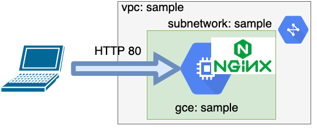

# 概要
Terratestを使ったインフラのテスト方法について

# [Terratestとは](https://terratest.gruntwork.io/docs/getting-started/introduction/#watch-how-to-test-infrastructure-code)
TerratestはインフラをテストするGoライブラリです。
提供している機能としては、以下の機能があります。

- Terraformコードのテスト
- Packerテンプレートのテスト
- Dockerイメージのテスト
- Helm Chartのテスト
- SSH経由のホストへのコマンド実行
- AWS,Azure,GCP,k8sのAPI
- HTTPリクエストの作成
- shellコマンドの実行


Goのライブラリであり、HTTPリクエストを使いテストの記述もできるため、インフラの設定値のみだけではなく、自動化できる機能テスト、結合テストも一括して書くことが可能となります。

# 使い方
## 環境の要件
TerratestはGoライブラリであり、実行環境は1.13以上のバージョンである必要があります。

Terratestのライブラリは、以下のように取得します。
以下では、terratestのterraform,gcp,http-helper ライブラリの取得方法を示します。

- terratestライブラリ
```
go get github.com/gruntwork-io/terratest/modules/terraform
```

- gcpライブラリ
```
go get github.com/gruntwork-io/terratest/modules/gcp
```

- http-helperライブラリ
```
github.com/gruntwork-io/terratest/modules/http-helper
```

また、これらライブラリに依存するするライブラリを取得する必要があります。
実行環境で不足する場合は、取得してください。

## テストの書き方
Terratestの利用はテストで利用するモジュールをインポートして利用します。
テストの方法はtfstateのoutputブロックの値をテストします。  

参照の方法は、testコードからTerraformコードへの相対パスを`terrform.Options` の `TerraformDir` に渡し、`terraform.Options` オブジェクトを生成します。
このオブジェクトを`terraform`の`Output`メソッドに渡し、terraform outputコマンドを呼び出しoutputブロックの値を参照します。  

例えば、下記ディレクトリの構成としたとき、 `TerraformDir` に `../test` を渡して `terraform.Options`オブジェクトを生成します。
```
.
├── README.md
├── src # terraformコードのディレクトリ
│   ├── main.tf
│   ├── output.tf
│   ├── provider.tf
│   └── terraform.tf
└── test  # terratestコードのディレクトリ
    └── network_test.go
```
Terratestはterraformやその他のplatformのSDKをラップしています。
そのため、先に説明したように outputコマンドやその他のTerraformコマンドを呼ぶことができます。つまり、テストコード内部で terraform apply, terraform destroyによるリソースの変更が可能となります。

## HelloWorldのテスト
ここでは、Hello Worldの文字列を出力するTerraformをテストする方法について説明します。
この説明のディレクトリ構成は、以下のとおりです。
```
helloworld
├── helloworld_test.go  Hello WorldをテストするTerratestコード
└── main.tf             Hello Worldを出力するTerraformコード
```
Hello Worldを出力するTerraformコードは、以下の通りです。
```
output "helloworld" {
  value = "Hello World"
}
```
上記outputをテストするTerraformコードは、以下の通りです。
TerratestとTerraformのコードは同一ディレクトリにあるので、`TerraformDir` に `.` を渡します。
```
package helloworld

import(
    "testing"

    "github.com/gruntwork-io/terratest/modules/terraform"
    "github.com/stretchr/testify/assert"
)

func TestHelloWorld(t *testing.T) {
    t.Parallel()

    terraformOption := &terraform.Options{
        TerraformDir: "./",
    }

    actual := terraform.Output(t, terraformOption, "helloworld")
    expected := "Hello World"

    assert.Equal(t, expected, actual)
}
```

## Webシステムのテスト
次に、下記のような構成のシステムについてテストをします。



このシステムは、GCP上にVPCネットワークを作成し、GCEを作成し、当該システムにNginxをインストールしたWebシステムです。

テストでは、GCPの設定とWebシステムへの通信を確認するテストを実施します。
GCPの設定項目およびWebシステムへの通信要件は、以下の通りです。
